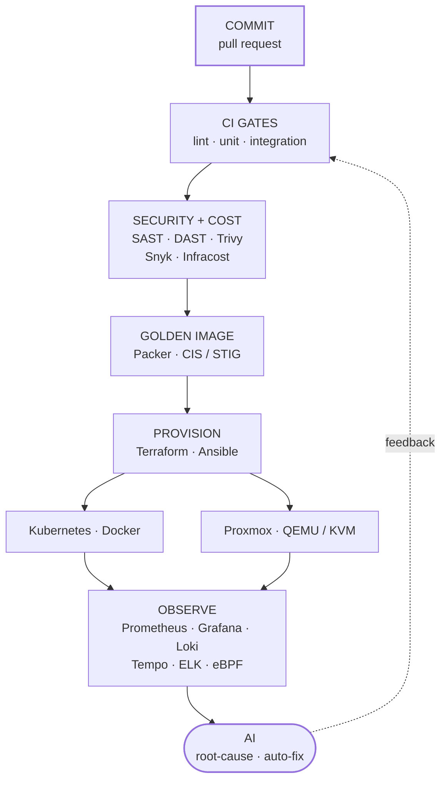

<div align="center">

# Umar Sabirin

### DevOps Engineer &nbsp;·&nbsp; Platform &nbsp;·&nbsp; SRE &nbsp;·&nbsp; Cloud

**I build infrastructure from bare-metal to cloud — with AI wired into CI/CD, observability, and incident response.**

<a href="https://www.linkedin.com/in/umar-sabirin-5896481a5"></a>
<a href="mailto:umarsabirin369@gmail.com"></a>


</div>

```console
$ whoami
umar sabirin — devops engineer @ Apple Developer Institute × S-Quantum Engine

$ cat /etc/profile.d/umar.env
EXPERIENCE="5 years — backend → platform → devops"
FOCUS="CI/CD · IaC · observability · hardening · virtualization"
PRIMARY_LANG="Go"
SCALE="19,400+ concurrent streams · 194 agents · multi-tenant"
AI_IN_THE_LOOP="true"

$ uptime
building things that stay up
```

## 🧰 Tech Stack

<div align="center">
<table>
<tr>
<td align="right"><b>&nbsp;Cloud&nbsp;&&nbsp;Systems&nbsp;</b></td>
<td></td>
</tr>
<tr>
<td align="right"><b>&nbsp;IaC&nbsp;&&nbsp;CI/CD&nbsp;</b></td>
<td></td>
</tr>
<tr>
<td align="right"><b>&nbsp;Observability&nbsp;</b></td>
<td></td>
</tr>
<tr>
<td align="right"><b>&nbsp;Languages&nbsp;</b></td>
<td></td>
</tr>
<tr>
<td align="right"><b>&nbsp;Data&nbsp;&&nbsp;Messaging&nbsp;</b></td>
<td></td>
</tr>
</table>
</div>

<div align="center">


<br>


<br>


</div>

## ⚙️ The pipeline I build



## 📈 Numbers I've shipped

<div align="center">

| Result | What it was | Where |
| :--- | :--- | :--- |
| **19,400+** concurrent streams | Go engine multiplexing gRPC/SSE from 194 agents at ms latency | Maxcloud |
| **~83%** faster pipelines | Parallelization, dependency caching, selective re-runs in Jenkins | ADI × S-Quantum |
| **~300%** faster VM boot | Custom Go orchestrator over QEMU/QMP — boot down to ~2s | Maxcloud |
| **45 min → <5s** | Tenant branding deploys via a JSON-driven config system, 6+ tenants | Maxcloud |
| **~40%** less provisioning time | Self-service LBaaS on HAProxy + nftables at the kernel level | Maxcloud |
| **2,683 req/s** | Kafka-backed async pipeline, ~3 orders of magnitude over the sync baseline | Freelance |
| **~99.9%+** payment availability | Multi-gateway failover with rate limiting and 2FA | Maxcloud |
| **~50%** faster queries | Targeted indexing + SQL refactoring on high-traffic multi-tenant tables | Fairtech |

</div>

## 🔭 What I'm doing now

- Infrastructure CI/CD in **Jenkins** for Terraform and Ansible — lint, test, security, and cost gates before anything is provisioned.
- Hardened golden images with **Packer**, benchmarked against CIS/STIG and scanned with Trivy.
- **AI** wired into monitoring and CI/CD for root-cause detection and auto-remediation.
- Cost- and security-aware observability on **Prometheus, Grafana, and ELK** with automated alerting.

## 🚀 Selected repositories

| Repo | What it is |
| :--- | :--- |
| [`job-board`](https://github.com/umars28/job-board) | Spring Boot microservices platform — modular services, independent deploys |
| [`spring-sync-vs-async-benchmark`](https://github.com/umars28/spring-sync-vs-async-benchmark) | Benchmark of 5 concurrency strategies; Kafka path sustained 2,683 req/s |
| [`mock-pilot`](https://github.com/umars28/mock-pilot) | Pluggable mock API server for REST and GraphQL with dynamic config |
| [`personal-finance-tracker`](https://github.com/umars28/personal-finance-tracker) | Laravel REST API on PostgreSQL + Redis, containerized with Docker |

---

<div align="center">

**B.Sc. Information Systems** — Hasanuddin University · GPA 3.82 / 4.00


<sub>Let's talk infrastructure — <a href="mailto:umarsabirin369@gmail.com">umarsabirin369@gmail.com</a> · <a href="https://www.linkedin.com/in/umar-sabirin-5896481a5">LinkedIn</a></sub>

</div>
